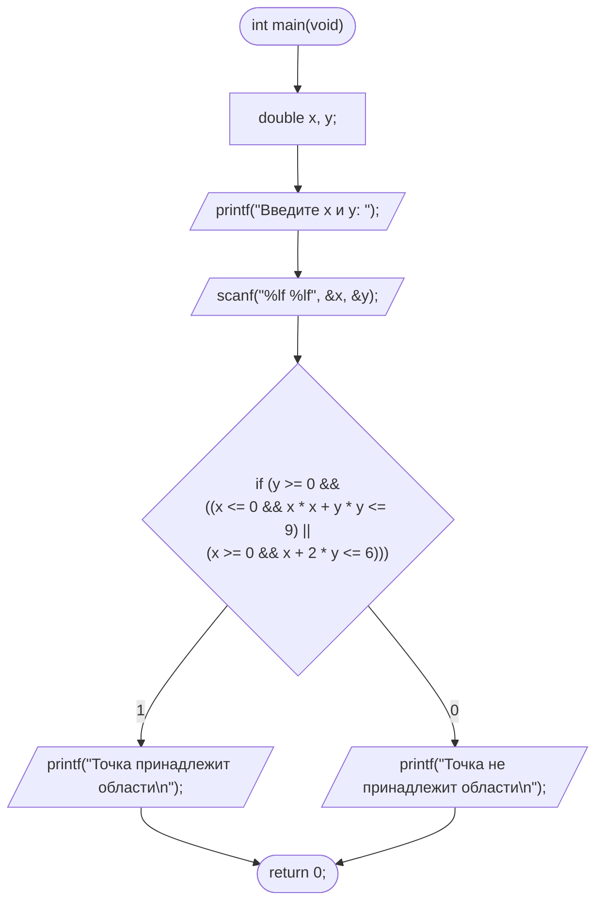

# homework-6

```mermaid
flowchart TD
    A(["int main(void)"]) --> B["double x, y;"]
    B --> C[/"printf(#quot;Введите x и y: #quot;);"/]
    C --> D[/"scanf(#quot;%lf %lf#quot;, &amp;x, &amp;y);"/]
    D --> E{"if (y &gt;= 0 &amp;&amp;<br/>((x &lt;= 0 &amp;&amp; x * x + y * y &lt;= 9) ||<br/>(x &gt;= 0 &amp;&amp; x + 2 * y &lt;= 6)))"}
    E -->|1| F[/"printf(#quot;Точка принадлежит области#92;n#quot;);"/]
    E -->|0| G[/"printf(#quot;Точка не принадлежит области#92;n#quot;);"/]
    F --> H(["return 0;"])
    G --> H
```
